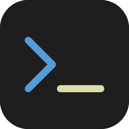

<div align="center">



# Commands Extension

**One-click command runner for VS Code.** Define commands in JSON or let the extension pick up
your `package.json` scripts and `.ps1` files automatically — then run anything from a sidebar or panel.

[](https://marketplace.visualstudio.com/items?itemName=PavelKhabusov.commands-extension)
[](https://marketplace.visualstudio.com/items?itemName=PavelKhabusov.commands-extension)
[](https://marketplace.visualstudio.com/items?itemName=PavelKhabusov.commands-extension&ssr=false#review-details)


</div>

---

> 💬 Questions → [Discussions · Q&A](https://github.com/PavelKhabusov/CommandsExtension/discussions/categories/q-a) · Ideas → [vote](https://github.com/PavelKhabusov/CommandsExtension/discussions/categories/ideas) · Bugs → [Issues](https://github.com/PavelKhabusov/CommandsExtension/issues/new/choose)

## Quick Start

```bash
code --install-extension PavelKhabusov.commands-extension
```

1. Open a workspace in VS Code
2. Create `commands-list.json` in the root (or just have a `package.json` with scripts)
3. Click the **Commands** icon in the Activity Bar — done

---

> 📚 **Detailed docs** live in [`docs/`](docs/): [Server Uploads](docs/server-uploads.md) · [SQL Console](docs/sql-console.md) · [Combined Operations](docs/combined-operations.md) · [Claude Hooks Manager](docs/claude-hooks.md).

## Features

### Sidebar & Panel

Access your commands from the Activity Bar sidebar or open a dedicated panel via `Ctrl+Shift+P` > **Commands: Open Panel**.

### Search & Filter

Filter commands instantly by typing in the search bar. Matches command names, command text, and group names. Groups auto-expand during search and restore their collapsed state when cleared.

### Context Menu

Right-click any command to access:

| Action | Availability |
|--------|-------------|
| Add / Remove from favorites | All commands |
| Enable / Disable confirmation | All commands |
| Stop terminal | Commands with active terminal |
| Move to group | Custom commands only |
| Delete | Custom commands only |

### Run Confirmation

Enable confirmation for critical commands via the context menu. Protected commands show a lock icon indicator and require a modal confirmation dialog before running.

### Collapsible Groups

Organize commands into named groups. Collapse/expand individual groups or all at once. Group state is preserved across sessions. Command count badge appears on hover.

### Favorites

Star any command to pin it to the **Favorites** group at the top. Use the star button or right-click > "Add to favorites". Favorites persist across sessions.

### Multiple Shell Types

| Type | Runs as |
|------|---------|
| `terminal` | Default shell (bash, zsh, cmd, ...) |
| `node` | `node <command>` |
| `pwsh` | `pwsh -Command <command>` |

### Add Commands from UI

Click **+** in the toolbar to add new commands without touching JSON. Pick an existing group or create a new one on the fly.

### Terminal Management

- Re-running a command reuses its existing terminal
- Active terminals show a green indicator dot and a close button
- Stop terminals via the close button, context menu, or the **Clear Terminals** toolbar button

### Auto-Detection

| Source | Group | Auto-refresh |
|--------|-------|:------------:|
| `commands-list.json` | Custom groups | Yes |
| `package.json` scripts | npm scripts | Yes |
| `*.ps1` files | PowerShell scripts | Yes |

### Server Uploads

Per-project **FTP / FTPS / SFTP** upload targets in `server-uploads.local.json`, run
with one click — live progress, cancel, mirror deploys, parallel transfers,
`skipUnchanged`, badge-exact "Modified" uploads, and a Quick Upload for one-off
files. **[Full reference → docs/server-uploads.md](docs/server-uploads.md).**

### Marketplace Templates

The built-in **Recommended** section offers ready-made command sets:

| Template | Description |
|----------|-------------|
| React | Dev server, build, test, lint, format |
| Node.js Backend | Start, dev, build, test, DB migrate |
| Next.js | Dev, build, start, lint |
| Docker | Build, compose up/down, logs |
| Expo | Start, iOS/Android, EAS build/submit |
| Python | Run, pytest, pip install/freeze |
| Git | Status, pull, push, stash, log |
| Turborepo | Monorepo build, dev, lint, test |
| Deploy | Vercel & Netlify deploy commands |
| Testing | Test, watch, coverage |
| Linting | Lint, format, typecheck |
| Git Hooks | Prepare, pre-commit, pre-push |

Click **+** on a template to add the whole set, or expand it and add individual commands.

### Theme-Aware

Uses VS Code CSS variables — looks native in any theme (light, dark, high contrast).

---

## `commands-list.json` Format

```json
{
  "commands": [
    {
      "name": "Build Project",
      "command": "npm run build",
      "type": "terminal",
      "group": "Build"
    },
    {
      "name": "Start Server",
      "command": "server.js",
      "type": "node",
      "group": "Dev"
    },
    {
      "name": "Deploy",
      "command": "./scripts/deploy.ps1",
      "type": "pwsh",
      "group": "Deploy"
    }
  ]
}
```

### Fields

| Field | Type | Required | Description |
|-------|------|:--------:|-------------|
| `name` | string | yes | Display name in the UI |
| `command` | string | yes | Command to execute |
| `type` | `"terminal"` \| `"node"` \| `"pwsh"` | yes | Execution type |
| `group` | string | no | Group name (default: `"General"`) |
| `cwd` | string | no | Working directory relative to workspace root |
| `stop` | string | no | Name of a command that stops this one (see below) |
| `hidden` | boolean | no | Hide this command from the list (default `false`) |

### Bound stop command (`stop` + `hidden`)

Link a **start** command to a **stop** command by the stop command's `name`.
While the start command is running (its terminal is open), its card shows a red
**⏹ Stop** icon next to the ✕. Clicking it **closes the start command's terminal
and runs the bound stop command**. Mark the stop command `"hidden": true` so it
isn't shown as its own card (it's only reached through the Stop icon).

Several start commands can share one stop command — e.g. all your "start"
variants bound to a single "stop project" — and on/off pairs (a service "up"
bound to its "down") toggle from one icon.

```json
{
  "commands": [
    { "name": "▶ Start (full)",    "command": "./start.sh",           "type": "terminal", "group": "App", "stop": "■ Stop" },
    { "name": "▶ Start (partial)", "command": "./start-partial.sh",   "type": "terminal", "group": "App", "stop": "■ Stop" },
    { "name": "■ Stop",            "command": "./stop.sh",            "type": "terminal", "group": "App", "hidden": true },

    { "name": "Storage up",   "command": "docker compose up -d",   "type": "terminal", "group": "App", "stop": "Storage down" },
    { "name": "Storage down", "command": "docker compose down",    "type": "terminal", "group": "App", "hidden": true }
  ]
}
```

> The Stop icon appears only while the command's terminal is open. Terminal-type
> commands keep their terminal open after running (even `docker … up -d`), so the
> icon stays available until you stop or close it.

Each group header also has a **pencil** icon (next to the count) that opens the
file the group's commands come from — `commands-list.json` for custom groups,
`package.json` for the npm scripts group.

---

## `package.json` Scripts

Scripts from your `package.json` are auto-imported under the **npm scripts** group:

```json
{
  "scripts": {
    "build": "tsc -p ./",
    "test": "jest",
    "start": "node server.js"
  }
}
```

These appear as `npm run build`, `npm run test`, `npm run start`.

---

### Claude Hooks Manager

Manage [Claude Code hooks](https://docs.anthropic.com/en/docs/claude-code/hooks) from
the panel across project / local / user-global `settings.json` — toggle, edit, presets,
copy/paste across projects. **[Full reference → docs/claude-hooks.md](docs/claude-hooks.md).**

---

### Combined Operations

Bundle terminal commands, server uploads, and helpers (wait / open / sound /
notification / vscode-cmd) into one ordered, cancellable sequence defined in
`commands-list.json`. **[Full reference → docs/combined-operations.md](docs/combined-operations.md).**

---

### Cross-platform requirements

`sound`, `notification`, and `open` steps (in Combined Operations) and
the matching presets (in Claude Hooks Manager) rely on small system
utilities. Most are already installed on desktop Linux / macOS / Windows;
some Linux setups (servers, minimal distros) need extras.

| Feature        | Linux                                            | macOS                       | Windows                                      |
|----------------|--------------------------------------------------|-----------------------------|----------------------------------------------|
| Play sound     | `paplay` (pulseaudio-utils) or `aplay`           | `afplay` (built-in)         | PowerShell `[console]::beep()` (built-in)    |
| Notification   | `notify-send` (libnotify-bin)                    | `osascript` (built-in)      | PowerShell + .NET MessageBox (built-in); `BurntToast` module for toast notifications |
| Open URL/file/app | `xdg-open` (xdg-utils)                        | `open` (built-in)           | `start ""` (built-in)                        |

**Install commands when something's missing:**

- Ubuntu / Debian: `sudo apt install libnotify-bin pulseaudio-utils xdg-utils`
- Fedora: `sudo dnf install libnotify pulseaudio-utils xdg-utils`
- Arch: `sudo pacman -S libnotify libpulse xdg-utils`
- macOS: everything ships with the OS
- Windows: nothing required for basics; for richer toast notifications, run `Install-Module -Name BurntToast -Force` in PowerShell

The editor's "Add step ▾" submenu shows a ⚠ icon next to presets
whose underlying tool isn't detected on the current OS, with a tooltip
hint about what to install.

---

## SQL Console

Give a server an `sql` block in `server-uploads.local.json` and the Server
Uploads header gains a **database button** opening a console panel with two
tabs: **Query** (a phpMyAdmin-style box — `Ctrl+Enter`, one result table per
statement, full MySQL errors) and **Export** (dump the database as full, schema
only or data only, with live progress).

Queries and dumps run **on the server over SSH**, not from your machine — over
the internet every client round-trip costs network latency, so the same dump
takes seconds server-side instead of minutes. Needs SSH access and your key
installed (`ssh-copy-id user@host`).
**[Full reference → docs/sql-console.md](docs/sql-console.md).**

---

## Configuration

| Setting | Default | Description |
|---------|---------|-------------|
| `commandsExtension.configFile` | `commands-list.json` | Path to commands config file (relative to workspace root) |
| `commandsExtension.uploadsFile` | `server-uploads.local.json` | Path to server uploads config file (relative to workspace root) |
| `commandsExtension.externalApiUrl` | `""` | Optional base URL of an external hub that receives upload / staleness / combined-op events and the merged command list. Empty disables. |

---

## Changelog

See [CHANGELOG.md](CHANGELOG.md) for a full list of changes per version.

## Requirements

- VS Code 1.85.0+

## License

MIT
